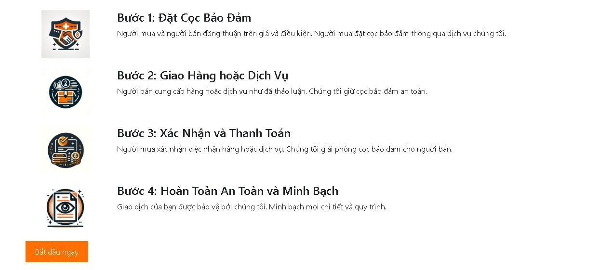
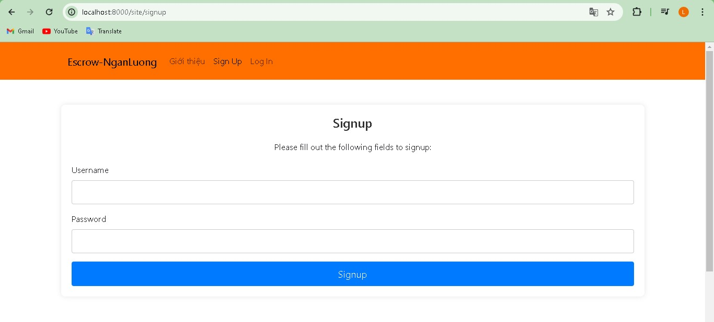

# Sale website with Alepay payment method

```
Register your account in https://www.nganluong.vn/vn/home.html to get merchant_id and merchant_password.
```

<p align="center">
  <br/>
  <br/><br/><br/>
</p>

## Introduction
Using ```docker-compose up --build``` to up this project onto your Docker.
Then open PHP image terminal to run ```php yii migrate``` to create table in your database.
<p align="center">
  <br/><br/><br/>
</p>

## Login to phpmyadmin to control your data server
<p align="center">
  <br/><br/><br/>
</p>

## Sign up account
<p align="center">
  <br/><br/><br/>
</p>

## Confirm email
<p align="center">
  Log in with your signed up account, then click on 'Tài khoản' to edit your account info.<br/>
  Add email that has been registered in Nganluong.vn<br/>
  <br/>
  -------------------------------------<br/>
  Open /app/runtime/mail in Docker Desktop.<br/>
  <br/>
  -------------------------------------<br/>
  Enter confirm link onto browser.<br/>
  <br/>
  You will see this in your account.<br/> 
  <br/>
</p>

## Create Order
<p align="center">
  Click on 'Tạo đơn hàng mới' in 'Đơn hàng bán'.<br/>
  <br/>
  -------------------------------------<br/>
  Enter your customer id + sale product.<br/>
  <br/>
  -------------------------------------<br/>
  In customer view (another account).<br/>
  <br/>
  -------------------------------------<br/>
  Click on 'Accept request', then 'Chuyển tiền cho bên trung gian' and enter your merchant_id and password that have been registered in Nganluong.<br/>
  <br/>
  <br/>
  -------------------------------------<br/>
  In your account in nganluong.vn, you will see this:<br/>
  <br/><br/><br/>
</p>

